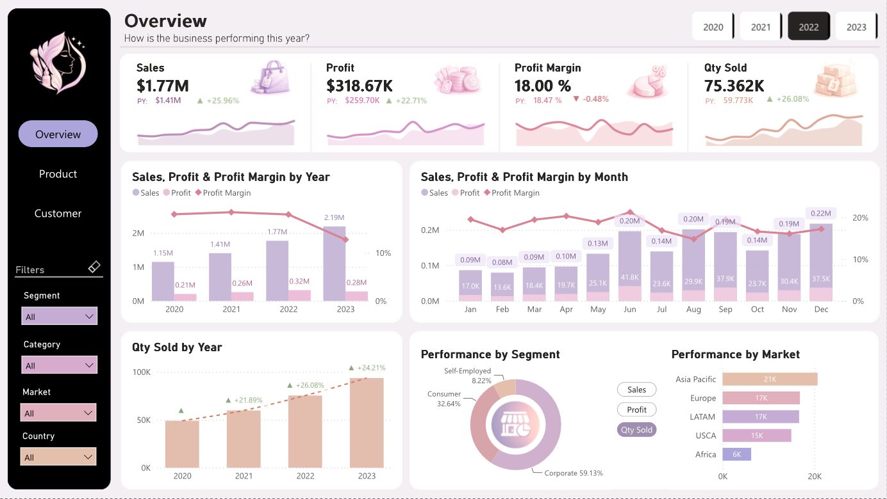
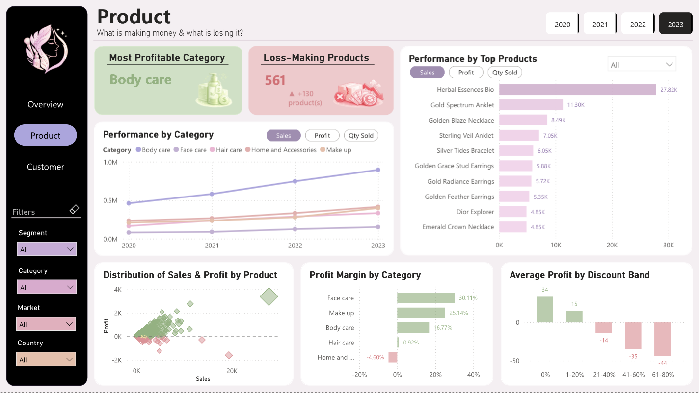
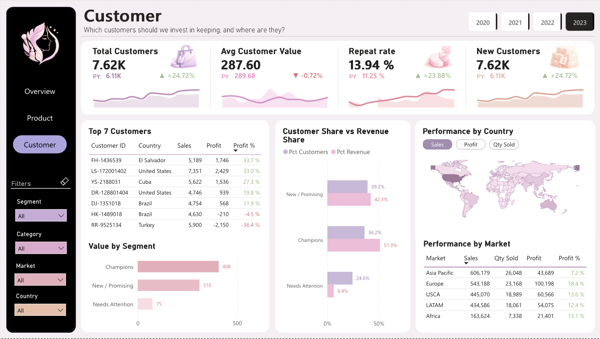

# Global Skincare & Beauty E-Store — E-Commerce Analytics

An end-to-end analytics project that turns a raw global beauty e-commerce dataset into a decision-ready three-page Power BI dashboard and a findings report — covering the full workflow from data cleaning in Python to SQL analysis in PostgreSQL to visualization and storytelling.

---

## Overview

A global skincare & beauty e-store wanted to understand its multi-year performance: **how the business is performing year over year, which products actually make money, and which customers are worth keeping.**

This project answers those questions across three analytical lenses — business health, product profitability, and customer value — delivered as a three-page interactive dashboard supported by a written findings report. The emphasis is on turning raw transaction data into clear, defensible business insight, not just charts.

---

## Dashboard Preview

📥 **[Download the Power BI file (.pbix)](https://drive.google.com/file/d/1OEsYXsfrM4WM9YGayfVtI8jyQRzE17Pw/view?usp=sharing)** — open in Power BI Desktop for the interactive version.

📄 **[View the dashboard as PDF](beauty_dashboard.pdf)** — all three pages, no Power BI needed.

**Page 1 — Overview** *(How is the business performing this year?)*

**Page 2 — Product** *(What's making money & what's losing it?)*

**Page 3 — Customer** *(Which customers should we invest in keeping, and where are they?)*

---

## Dataset

- **Grain:** transaction-line level — one row per product per order
- **Fields:** order & customer IDs, order date, customer segment, full geography (city, state, country, lat/long, region, market), product hierarchy (category → subcategory → product), and financials (quantity, sales, discount, profit)
- **Period:** 2020–2023
- **Currency:** USD
- **Context:** global direct-to-consumer beauty & skincare e-commerce

---

## Tools

| Stage | Tool |
|-------|------|
| Cleaning & validation | Python (pandas, VS Code) |
| Data storage & querying | PostgreSQL (SQL) |
| Segmentation | SQL (RFM with window functions) |
| Dashboard & measures | Power BI (DAX) |
| Report | Markdown |

---

## Business Questions

1. **Overview** — How is the business performing this year versus last, across sales, profit, margin and volume?
2. **Product** — Which products and categories make money, and what drives the losses?
3. **Customer** — Who are our most valuable customers, are we keeping them, and where are they?

---

## Data Preparation

1. **Load & profile (Python)** — read the source Excel sheet into pandas, profiled shape, data types, and missing values.
2. **Clean & validate** — standardised column names to snake_case, parsed date fields to proper datetimes, dropped duplicates, and ran validation checks (unique keys, value ranges, negative-profit detection). The data proved internally consistent, so cleaning focused on validation and type correctness rather than imputation.
3. **Type correction** — resolved a discount field that imported as whole numbers (rounding 0.4/0.6 to 0/1); corrected to decimal so discount bands could be analysed.
4. **Load to PostgreSQL** — loaded the cleaned table into PostgreSQL for querying.
5. **RFM segmentation (SQL)** — built a customer-level view scoring each customer 1–4 on Recency, Frequency, and Monetary value using `NTILE(4)` window functions, then mapped score combinations to named segments (Champions, Loyal, New/Promising, At Risk, Needs Attention, Lost). Exported to CSV and joined back to the transaction data in Power BI on customer_id.

---

## Analysis & Insights

### Page 1 — Overview (Business Health, 2022 → 2023)

- **Sales grew strongly** from 1.77M to 2.19M (**+23.82%**), and quantity sold rose in step (75.4K → 93.6K, **+24.21%**) — the business is expanding volume.
- **But profit fell** from 318.67K to 279.93K (**−12.16%**), and **profit margin dropped** from 18.00% to 12.77% (**−5.23 pts**).
- **The core tension:** growth is being bought, not earned. The business is selling more while keeping less of each dollar — a classic sign that discounting or cost is eroding the bottom line even as the top line rises.

### Page 2 — Product (What Makes Money vs What Loses It)

- **Profit concentrates in a few categories** — Face care (30.1% margin), Make up (25.1%), and Body care (16.8%) are healthy earners.
- **Home & Accessories loses money overall** — the only category with a **negative margin (−4.60%)**, making it the primary drag on profitability.
- **Discounting is the cause.** Average profit by discount band shows a clear cliff: orders at 0% discount earn +34 profit on average and 1–20% earn +15, but profit turns **negative beyond 20%** — falling to −14 (21–40%), −35 (41–60%), and −44 (61–80%). **Orders discounted above ~20% lose money on average**, and the losses concentrate in Home & Accessories, where discounting is heaviest.
- **561 products are loss-making**, up +130 year over year — the losses are spreading, not shrinking.

### Page 3 — Customer (Value, Retention, Geography, 2022 → 2023)

- **A small segment drives most revenue.** Champions are ~26–36% of customers but **~51% of revenue** — a strong Pareto concentration. This makes retaining the top segment the single highest-leverage lever in the business.
- **Value per customer is steeply tiered** — Champions and Loyal customers are worth multiples of the Needs-Attention and Lost segments, confirming that not all customers are equal.
- **Repeat rate improved** (9.62% → 11.25% → 13.94%), signalling growing loyalty, though absolute repeat rates remain low — a retention opportunity.
- **Geography is concentrated** — Asia Pacific and Europe lead on sales, but **Europe is the most profitable market (18.4% margin)** while Asia Pacific, despite the highest sales, runs a thinner 7.2% — revenue leaders and profit leaders differ.

---

## Recommendations

- **Cap discounts near 20%.** The data shows margin turns negative beyond that threshold; deep discounts are actively destroying profit and are the main driver of the year-over-year margin decline.
- **Fix or reposition Home & Accessories** — the only loss-making category and the one absorbing the heaviest discounting. Review its pricing and promotion strategy before it drags overall profitability further.
- **Protect the Champions segment.** With ~51% of revenue concentrated in the top segment, targeted retention and loyalty investment here defends the majority of the business — and mitigates the concentration risk of depending on so few customers.
- **Grow the profitable markets, not just the biggest ones.** Europe's superior margin makes it a better growth target than higher-volume, lower-margin Asia Pacific.
- **Convert one-time buyers.** Repeat rate is rising but still low; win-back campaigns aimed at recently-lapsed high-value customers (visible in the Top Customers table) could lift retention.

---

The Power BI file (`.pbix`) is hosted on Google Drive — see the download link above.

---

## How to Run

1. **Download the files** from this repository, and the `.pbix` from the Google Drive link above.
2. **Clean** — run the Python cleaning script to profile, validate, and export the cleaned data.
3. **Load to PostgreSQL** — load the cleaned CSV and run the SQL scripts, including the RFM segmentation view.
4. **Open the dashboard** — open the Power BI (`.pbix`) file in Power BI Desktop.
5. **Read the findings** — see `FINDINGS.md` for the full written analysis.

---

*Built as a portfolio project demonstrating the full analytics workflow — data cleaning, SQL segmentation, dashboard design, and business storytelling.*
